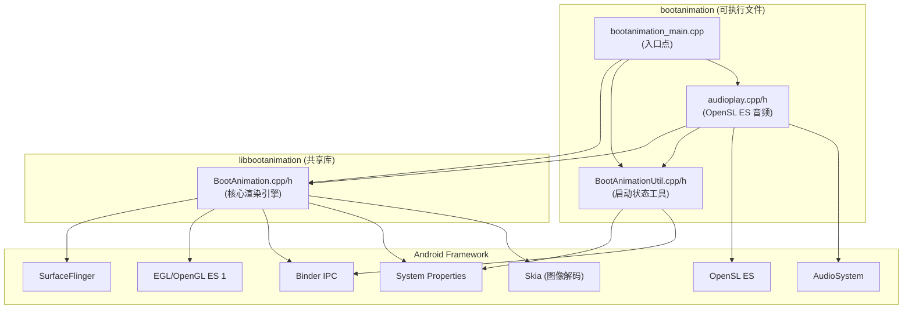
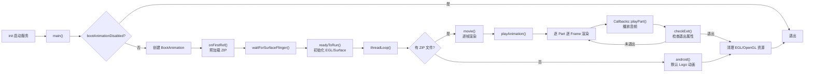

# Code Insight: AOSP bootanimation (frameworks/base/cmds/bootanimation)

## 项目类型

**Code Project** — Android 原生 C++ 可执行程序 + 共享库，AOSP 开机/关机动画实现。

---

## 项目概述

这是 AOSP 原始的 bootanimation 模块，位于 `frameworks/base/cmds/bootanimation`。它是 Android 系统开机时显示动画的服务进程，由 init 系统在开机早期启动。此目录中的代码已被 Amazon/FireOS 通过 Metatag 方式进行了多处定制修改。

- **主要语言**: C++ (2527 行)
- **目标平台**: Android/FireOS（系统级原生服务）
- **构建系统**: Android Blueprint (`Android.bp`)
- **产物**: `bootanimation` 可执行文件 + `libbootanimation` 共享库

---

## 目录结构与模块职责

```
frameworks/base/cmds/bootanimation/
├── bootanimation_main.cpp     # 程序入口点
├── BootAnimation.cpp          # 核心动画引擎（OpenGL ES 1 渲染、ZIP 解析、帧播放）
├── BootAnimation.h            # BootAnimation 类定义（Thread + DeathRecipient）
├── BootAnimationUtil.cpp      # 工具函数（禁用检测、等待 SurfaceFlinger、音频判断）
├── BootAnimationUtil.h        # 工具函数声明
├── audioplay.cpp              # OpenSL ES 音频播放引擎（WAV 解析 + 缓冲队列播放）
├── audioplay.h                # 音频播放接口声明
├── Android.bp                 # 构建配置（Blueprint 格式）
├── bootanim.rc                # Android init 服务定义文件
└── FORMAT.md                  # bootanimation.zip 格式文档
```

相比 FireOSBootAnimation 版本（在 `fireos/base/features/FireOSBootAnimation/` 中），此目录少了：
- `audioplay_fosExt.cpp/h`（Amazon 音频设备选择扩展，被内联到此处的 audioplay.cpp 中）
- `sepolicy/` 目录（独立的 SELinux 策略）
- `featuremap`、`fireos_boot_animation.mk`

---

## 代码行数统计

| 文件 | 行数 | 职责 |
|------|------|------|
| BootAnimation.cpp | 1503 | 核心渲染引擎 |
| audioplay.cpp | 508 | 音频播放引擎 |
| BootAnimation.h | 227 | 类接口定义 |
| BootAnimationUtil.cpp | 156 | 启动状态检测工具 |
| bootanimation_main.cpp | 59 | 程序入口 |
| audioplay.h | 42 | 音频接口声明 |
| BootAnimationUtil.h | 32 | 工具接口声明 |
| **总计** | **2527** | |

---

## 入口点与构建/运行

### 入口点

`bootanimation_main.cpp` 中的 `main()` 函数：
1. 设置进程优先级为 `ANDROID_PRIORITY_DISPLAY`
2. 检查是否禁用动画 (`bootAnimationDisabled()`)
3. 创建 `BootAnimation` 对象（传入 `audioplay::createAnimationCallbacks()`）
4. 等待 SurfaceFlinger 就绪
5. 启动动画线程 (`boot->run()`)
6. 加入 Binder 线程池

### 构建配置

- **cc_binary `bootanimation`**: 最终可执行文件，链接 `libbootanimation`、`libOpenSLES`、`libaudioclient`
- **cc_library_shared `libbootanimation`**: 动画核心逻辑库，链接 EGL/OpenGL/GUI/HW UI
- **init 服务**: 通过 `bootanim.rc` 声明，路径 `/system/bin/bootanimation`，属于 `core animation` 类，以 `media` 用户运行，附属 `graphics audio` 组

### 运行条件

- 由 init 系统按类启动，`disabled + oneshot`
- IO 优先级为 `rt 0`，性能模式 `MaxPerformance`
- 通过 `service.bootanim.exit` 属性控制退出

---

## 依赖关系

### 外部共享库依赖

| 库 | 用途 | 所属目标 |
|---|---|---|
| libandroidfw | 资源/Asset 管理 | 两者共用 |
| libbase | Android base 工具 (属性读取) | 两者共用 |
| libbinder | Binder IPC 通信 | 两者共用 |
| libcutils | 系统属性读写 | 两者共用 |
| liblog | Android 日志 | 两者共用 |
| libutils | Thread, String8, Looper 等 | 两者共用 |
| libui | 显示配置、像素格式 | libbootanimation |
| libhwui | Skia 图像解码 | libbootanimation |
| libEGL | EGL 显示上下文管理 | libbootanimation |
| libGLESv1_CM | OpenGL ES 1.x 渲染 | libbootanimation |
| libgui | Surface/SurfaceFlinger 客户端 | libbootanimation |
| libOpenSLES | OpenSL ES 音频播放 | bootanimation |
| libaudioclient | AudioSystem 参数设置 | bootanimation |

### 内部模块依赖

- `bootanimation_main.cpp` → `BootAnimation.h`, `BootAnimationUtil.h`, `audioplay.h`
- `audioplay.cpp` → `BootAnimation.h` (Callbacks), `BootAnimationUtil.h`, `libaudioclient`
- `BootAnimation.cpp` → Android 框架层 (SurfaceFlinger, EGL, OpenGL, Skia)

---

## 模块通信与数据流

### 主要数据流

1. **Init 系统** → 启动 `bootanimation` 进程
2. **main()** → 创建 `BootAnimation` 对象，触发 `onFirstRef()` 预加载动画 ZIP
3. **BootAnimation::readyToRun()** → 获取显示配置，创建 Surface，初始化 EGL/OpenGL 上下文
4. **BootAnimation::threadLoop()** → 调用 `movie()` 或 `android()` 播放动画
5. **movie()** → 解析 `desc.txt`，按 Part 逐帧渲染 PNG 纹理，通过 Callback 触发音频
6. **audioplay::AudioAnimationCallbacks** → 在 `init()` 时异步初始化 OpenSL ES，在 `playPart()` 时播放 WAV
7. **system property `service.bootanim.exit`** → 触发退出

### 通信方式

| 方式 | 用途 |
|------|------|
| 函数调用 | 模块间主要通信 |
| Callback 模式 | `BootAnimation::Callbacks` 解耦动画与音频 |
| 系统属性 | 与 init 系统通信，控制启动/退出 |
| Binder IPC | 与 SurfaceFlinger 通信 |
| inotify | `TimeCheckThread` 监控时间文件变化 |
| AudioSystem::setParameters | RAD (Remote Audio Device) 控制 |

---

## Amazon/FireOS 定制修改 (Metatag 标记)

此 AOSP 目录中包含多处 Amazon 修改，通过 `Metatag(*)` 注释标记：

| Metatag | 文件 | 功能 |
|---------|------|------|
| `boot_animation.framework` | BootAnimation.h, BootAnimation.cpp | Callbacks 增加 `isPlaying()` 方法；退出时检查音频是否仍在播放 |
| `firetv_hd.graphics` | BootAnimation.cpp | 支持 `ro.config.size_override` 覆盖显示尺寸；使用 DisplayState 获取 viewport 信息 |
| `firetv_4k.graphics` | BootAnimation.cpp | 4K 设备分辨率限制逻辑，强制使用 maxWidth/maxHeight |
| `audio_manager.framework` | audioplay.cpp, Android.bp | RAD 音频设备控制（`OnBoot_RAD=on/off`）；链接 `libaudioclient` |
| `power_manager.framework` | BootAnimationUtil.cpp | `getLifecycleReason()` 检测启动原因，只有 Cold Boot 才播放开机音 |

---

## 关键设计模式

### 1. Thread 模式
`BootAnimation` 继承 `android::Thread`，通过 `threadLoop()` 驱动主渲染循环。

### 2. Callback/Observer 模式
`BootAnimation::Callbacks` 抽象接口提供 `init()`、`playPart()`、`shutdown()`、`isPlaying()` 回调。`AudioAnimationCallbacks` 实现该接口集成音频播放。

### 3. 异步初始化
`InitAudioThread` 后台线程初始化 OpenSL ES 引擎，避免阻塞动画线程。

### 4. 预加载 (Preload)
在 `onFirstRef()` 阶段（SurfaceFlinger 就绪之前）预加载 ZIP 动画资源，减少首帧显示延迟。

### 5. Binder 死亡通知
实现 `IBinder::DeathRecipient`，SurfaceFlinger 死亡时通过 `SIGKILL` 自杀。

### 6. Display Hotplug 处理
`DisplayEventCallback` 监听显示器热插拔事件，动态调整 Surface 尺寸。

---

## 模块关系图



## 主执行流程图



---

## 动画 ZIP 文件搜索优先级

### 开机动画
1. `/apex/com.android.bootanimation/etc/bootanimation.zip`
2. `/product/media/bootanimation.zip` (或 `bootanimation-dark.zip`)
3. `/oem/media/bootanimation.zip`
4. `/system/media/bootanimation.zip`

### 加密开机动画
1. `/product/media/bootanimation-encrypted.zip`
2. `/system/media/bootanimation-encrypted.zip`

### 关机动画
1. `/product/media/shutdownanimation.zip`
2. `/oem/media/shutdownanimation.zip`
3. `/system/media/shutdownanimation.zip`

### Userspace Reboot 动画
1. `/product/media/userspace-reboot.zip`
2. `/oem/media/userspace-reboot.zip`
3. `/system/media/userspace-reboot.zip`

---

## 与 FireOSBootAnimation 的对比

| 维度 | AOSP (此目录) | FireOSBootAnimation |
|------|---------------|---------------------|
| 位置 | `frameworks/base/cmds/bootanimation` | `fireos/base/features/FireOSBootAnimation` |
| 代码行数 | 2527 | 2577 |
| 安装路径 | `/system/bin/bootanimation` | `/system/system_ext/bin/fireos_bootanimation` |
| 产物名称 | `bootanimation` + `libbootanimation` | `fireos_bootanimation` + `libfireos_bootanimation` |
| 音频扩展 | 内联在 audioplay.cpp | 独立 `audioplay_fosExt.cpp/h` |
| SELinux | 无（依赖系统默认） | 独立 `sepolicy/` 目录 |
| 纹理过滤 | `GL_NEAREST` | `GL_LINEAR` |
| NPOT 检测 | 不含 `GL_APPLE_texture_2D_limited_npot` | 额外支持 Apple NPOT 扩展 |
| 覆盖关系 | 被 FireOS 版本覆盖（override） | 最终安装的版本 |

---

*报告生成时间: 2026-06-26*
