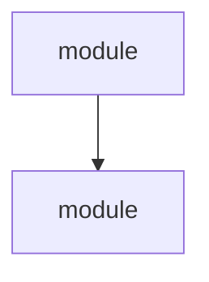
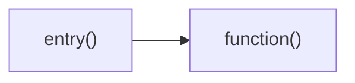
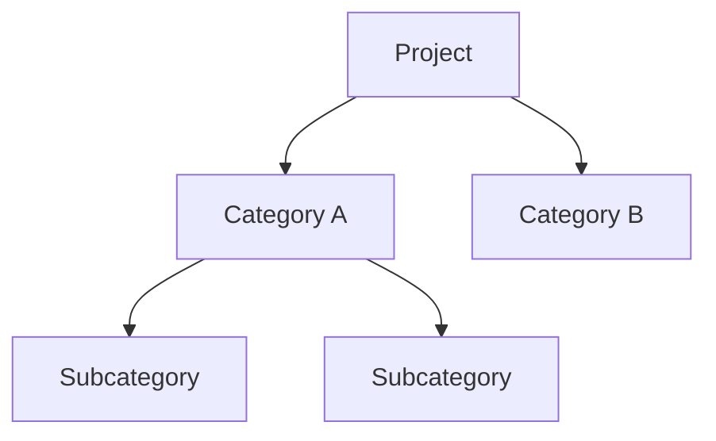
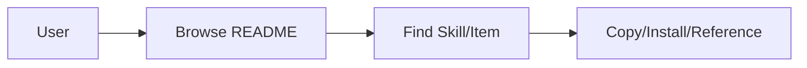

# Code Insight Report

> Auto-generated project analysis of the workspace.

## 0. Project Type Classification

| Item | Detail |
|------|--------|
| Detected Type | Code Project / Resource Project / Hybrid |
| Confidence | High / Medium / Low |
| Key Indicators | (list what led to this classification) |

---

<!-- ============================================ -->
<!-- CODE PROJECT SECTIONS (use for code projects) -->
<!-- ============================================ -->

## 1. Project Overview

| Item | Detail |
|------|--------|
| Project Name | |
| Purpose | |
| Primary Languages | |
| Architecture Style | |
| Total Files | |
| Estimated LOC | |

### Language Breakdown

| Language | Files | Approx. LOC | Percentage |
|----------|-------|-------------|------------|
| | | | |

## 2. Directory Structure

```
project-root/
├── ...
```

### Module Responsibilities

| Directory | Responsibility |
|-----------|---------------|
| | |

## 3. Entry Points and Build/Run

### Entry Points

| Entry Point | File | Description |
|-------------|------|-------------|
| | | |

### Build and Run

| Action | Command |
|--------|---------|
| Build | |
| Run | |
| Test | |

### Key Configuration Files

| File | Role |
|------|------|
| | |

## 4. Dependencies

### External Dependencies

| Dependency | Version | Purpose |
|------------|---------|---------|
| | | |

### Internal Module Dependencies

- `module_a` → `module_b`: reason
- ...

## 5. Module Communication and Data Flow

### Communication Methods

| From | To | Method |
|------|----|--------|
| | | |

### Primary Data Flow

1. ...
2. ...
3. ...

### Concurrency Patterns

- ...

## 6. Key Design Patterns

| Pattern | Where Used | Notes |
|---------|-----------|-------|
| | | |

### Error Handling Strategy

- ...

### Testing Structure

| Type | Location | Framework |
|------|----------|-----------|
| | | |

## 7. Call Relationship Diagrams

### Module Relationship Diagram



### Key Call Chain Diagram



## 8. Quick Start Guide

### Prerequisites

- ...

### Setup Steps

1. ...
2. ...
3. ...

### Key Files to Read First

| File | Why |
|------|-----|
| | |

---

<!-- ============================================== -->
<!-- RESOURCE PROJECT SECTIONS (use for non-code)   -->
<!-- ============================================== -->

## 1. Project Overview

| Item | Detail |
|------|--------|
| Project Name | |
| Purpose | |
| Content Type | (curated list / documentation / skill collection / template repo / config repo) |
| Target Audience | |
| Total Items/Entries | |
| Total Files | |

### File Type Breakdown

| File Type | Count | Percentage |
|-----------|-------|------------|
| | | |

## 2. Content Structure

```
project-root/
├── ...
```

### Section/Directory Responsibilities

| Directory/Section | Content Description | Item Count |
|-------------------|--------------------:|:----------:|
| | | |

### Organizational Pattern

- (by category / by tool / alphabetical / hierarchical / other)

## 3. Content Categories and Coverage

| Category | Items | Description |
|----------|:-----:|-------------|
| | | |

### Coverage Summary

- Most populated: ...
- Least populated: ...
- Notable gaps: ...

## 4. Contribution and Governance

| Item | Detail |
|------|--------|
| Contributing Guide | Yes/No |
| PR Template | Yes/No |
| CI/Automation | (describe) |
| License | |

### How to Add New Content

1. ...
2. ...

## 5. Usage and Integration

### How to Consume

- (browse on GitHub / install as package / copy into project / CLI tool / other)

### Scripts and Tooling

| Script/Tool | Purpose |
|-------------|---------|
| | |

### External Integrations

- ...

## 6. Content Relationship Diagram

### Content Organization Diagram



### Usage Flow Diagram



## 7. Quick Start Guide

### For Users

1. ...
2. ...

### For Contributors

1. ...
2. ...

### Key Files to Read First

| File | Why |
|------|-----|
| | |
