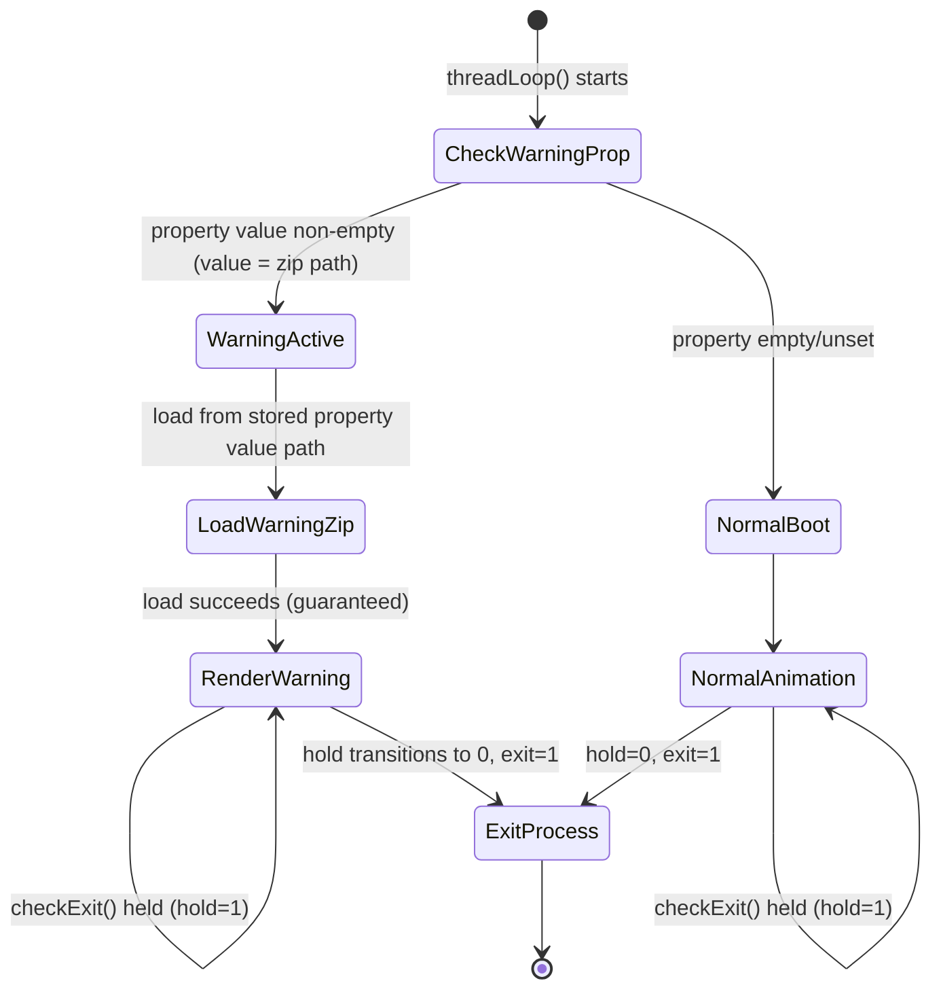

# Design Document: Power Warning Boot Animation

## Overview

This feature extends the FireOS boot animation system to display a power compatibility warning image when an incompatible power supply is detected. The implementation integrates into the existing `BootAnimation` class in `frameworks/base/cmds/bootanimation/`, leveraging the established zip-based animation loading and OpenGL ES rendering infrastructure.

The design adds three capabilities to the boot animation process:
1. **Power warning property check** — reads `sys.power.warning_zip` at the start of the thread loop. The value of this property IS the file path to the warning zip; boot animation reads the property and uses the value directly as the path to load the zip from. The file pointed to by this property is guaranteed to exist when the property is set.
2. **Warning image rendering** — loads and displays the warning zip using `loadAnimation()`/`playAnimation()` as a static frame
3. **Hold mechanism** — modifies `checkExit()` to honor `sys.bootanim.hold`, preventing process termination while the warning is visible

For the initial implementation, both properties are hardcoded: `checkPowerWarning()` returns the constant `POWER_WARNING_FILE` path (`/system/media/power_warning/en_US/warning.zip`) instead of reading the actual property, and the hold property is forced to `"1"`.

## Architecture

```mermaid
flowchart TD
    A[threadLoop() starts] --> B{checkPowerWarning()}
    B -->|property value non-empty| C[Store property value as zip path\nSet mPowerWarningActive = true]
    B -->|property value empty/unset| D[Normal boot animation path]
    C --> E[loadAnimation(stored zip path)]
    E --> F[playAnimation - static frame loop]
    F --> H{checkExit()}
    H -->|sys.bootanim.hold == 1| I[Return immediately - keep rendering]
    H -->|hold != 1| J[Check service.bootanim.exit]
    J -->|exit == 1| K[requestExit()]
    J -->|exit == 0| F
    I --> F
    D --> L[findBootAnimationFile / movie / android]
    L --> H
```

### Integration Points

The feature integrates at three specific locations in the existing code:

1. **`threadLoop()`** — new power warning check inserted as the first operation, before the existing `mZipFileName.isEmpty()` check
2. **`checkExit()`** — hold property evaluation added as the first check, before reading `EXIT_PROP_NAME`
3. **`BootAnimation.h`** — new member variables and a helper method declaration

## Components and Interfaces

### Modified Files

| File | Changes |
|------|---------|
| `BootAnimation.h` | Add member variables, constant, and method declaration |
| `BootAnimation.cpp` | Implement power warning check, modify `threadLoop()` and `checkExit()` |

### New Constants

```cpp
// Power warning zip path used for temporary hardcoding in initial implementation
static const char POWER_WARNING_FILE[] = "/system/media/power_warning/en_US/warning.zip";

// System property names
static const char POWER_WARNING_PROP_NAME[] = "sys.power.warning_zip";
static const char HOLD_PROP_NAME[] = "sys.bootanim.hold";
```

### New Member Variables (BootAnimation.h)

```cpp
bool mPowerWarningActive;   // Whether power warning display is required
String8 mPowerWarningPath;  // Zip file path obtained from the property value
```

### New Method

```cpp
// Check if power warning property is set; if so, store the path and update mPowerWarningActive
bool checkPowerWarning();
```

### Method Behavior

#### `checkPowerWarning()`

```
Input:  None (reads sys.power.warning_zip system property)
Output: bool — true if property value is non-empty, false otherwise

Behavior:
  1. Read POWER_WARNING_PROP_NAME via property_get() with empty default
     FOR INITIAL IMPLEMENTATION: hardcode the value to POWER_WARNING_FILE constant
  2. If value length > 0:
     a. Store the value directly as mPowerWarningPath (the property value IS the zip path)
     b. Set mPowerWarningActive = true
  3. If value length == 0:
     a. Set mPowerWarningActive = false
  4. Return mPowerWarningActive
```

#### Modified `threadLoop()`

```
Behavior:
  1. Call checkPowerWarning()
  2. IF mPowerWarningActive:
     a. Load warning zip via loadAnimation(mPowerWarningPath)
     b. Call playAnimation(*warningAnimation), release, cleanup EGL, return false
     c. Normal boot animation path is NEVER reached when mPowerWarningActive is true
  3. ELSE: proceed with existing logic (movie() or android())
  4. EGL cleanup (existing code)
```

#### Modified `checkExit()`

```
Behavior:
  1. Read HOLD_PROP_NAME via property_get() with "0" default
     FOR INITIAL IMPLEMENTATION: hardcode value to "1"
  2. IF value == "1": return immediately (do not evaluate exit)
  3. ELSE: proceed with existing EXIT_PROP_NAME check and requestExit() logic
```

## Data Models

### System Properties

| Property | Type | Values | Description |
|----------|------|--------|-------------|
| `sys.power.warning_zip` | string | File path or empty | The value IS the file path to the warning zip; boot animation reads this property and uses the value directly as the path to load the zip from. Set by the power management subsystem. |
| `sys.bootanim.hold` | string | "0" or "1" | Controls whether boot animation ignores exit signals |
| `service.bootanim.exit` | string | "0" or "1" | Existing exit signal (unchanged) |

### Warning Zip File Format

The warning zip follows the same format as standard boot animation zips:
- `desc.txt` — animation descriptor (width, height, fps, part definitions)
- `partN/` — directory containing image frame(s) as stored (uncompressed) PNG files

For a static warning display, the zip contains a single frame in a single part with infinite repeat (`count=0`), ensuring the same image is continuously re-rendered.

### State Transitions



## Correctness Properties

*A property is a characteristic or behavior that should hold true across all valid executions of a system — essentially, a formal statement about what the system should do. Properties serve as the bridge between human-readable specifications and machine-verifiable correctness guarantees.*

### Property 1: Non-empty property value activates warning and stores path

*For any* non-empty string value returned by the power warning property read, the `checkPowerWarning()` function SHALL return true, set `mPowerWarningActive` to true, and store that property value directly as the zip file path to load from, regardless of whether the string references an accessible file.

**Validates: Requirements 1.2, 1.5**

### Property 2: Empty property value deactivates warning

*For any* empty string (length 0) returned by the power warning property read, the `checkPowerWarning()` function SHALL return false and set `mPowerWarningActive` to false.

**Validates: Requirements 1.3**

### Property 3: Hold property prevents exit

*For any* invocation of `checkExit()` where the hold property value equals "1", the function SHALL return without calling `requestExit()`, keeping the rendering thread alive regardless of the exit property value.

**Validates: Requirements 3.1, 3.5**

### Property 4: Non-hold state allows normal exit evaluation

*For any* invocation of `checkExit()` where the hold property value is not "1" (including "0", empty, or unset), the function SHALL proceed to evaluate the exit property and call `requestExit()` if indicated.

**Validates: Requirements 3.2, 3.7**

### Property 5: Warning active always skips normal animation

*For any* execution of `threadLoop()` where `mPowerWarningActive` is true, the normal boot animation rendering path (`movie()` or `android()`) SHALL NOT be invoked.

**Validates: Requirements 4.2**

### Property 6: Warning inactive preserves normal behavior

*For any* execution of `threadLoop()` where `mPowerWarningActive` is false, the existing boot animation rendering logic SHALL execute unchanged.

**Validates: Requirements 4.3, 4.4**

## Error Handling

| Condition | Behavior | Log Level |
|-----------|----------|-----------|
| `sys.power.warning_zip` property unreadable | Treat as empty, proceed with normal animation | ALOGW |
| `sys.bootanim.hold` property unreadable | Treat as "0", proceed with normal exit logic | ALOGW |

### Fallback Strategy

When the power warning property is empty or unset, the normal boot animation runs as usual. When the property is set, the referenced zip file is guaranteed to exist and load successfully — no zip-failure fallback path is needed. The hold mechanism (`sys.bootanim.hold`) operates independently to keep the process alive while the warning is visible.

## Testing Strategy

### Unit Testing

Unit tests target the pure logic portions extracted into testable functions:

1. **`checkPowerWarning()` logic** — test with various property values (empty, whitespace, valid path, invalid path, very long string)
2. **`checkExit()` hold logic** — test that hold="1" prevents exit, hold="0" allows normal exit evaluation
3. **Property reading** — mock `property_get()` to inject test values

Framework: Google Test (gtest), already used in AOSP boot animation tests.

### Property-Based Testing

Property-based testing validates the core decision logic across a wide input space:

- **Library**: Google Test with a custom fuzzing approach (generating random property strings)
- **Minimum iterations**: 100 per property
- **Tag format**: `Feature: power-warning-boot-animation, Property N: <description>`

Properties to test:
- Property 1 & 2: Generate random strings of varying lengths (0 to 255 chars, including whitespace-only, path-like, garbage bytes) and verify the boolean decision matches the specification
- Property 3 & 4: Generate random hold property values and verify checkExit behavior
- Property 5 & 6: Generate random combinations of warningActive state and verify the correct rendering path is taken

### Integration Testing

Integration tests verify end-to-end behavior on-device:

1. **Warning display path** — set `sys.power.warning_zip` to a valid zip path, verify warning renders
2. **Hold mechanism** — set `sys.bootanim.hold=1`, verify boot animation does not exit when `service.bootanim.exit=1`
3. **Normal boot path** — clear warning property, verify standard boot animation unchanged

### Test Boundaries

| Aspect | In Scope | Out of Scope |
|--------|----------|--------------|
| Property logic | Unit + PBT | — |
| Zip loading | Integration | Unit (uses real file I/O) |
| OpenGL rendering | Integration (visual) | Unit (requires GPU context) |
| Hold mechanism timing | Integration | Unit (timing-dependent) |
| System property I/O | Mocked in unit tests | Real in integration |
