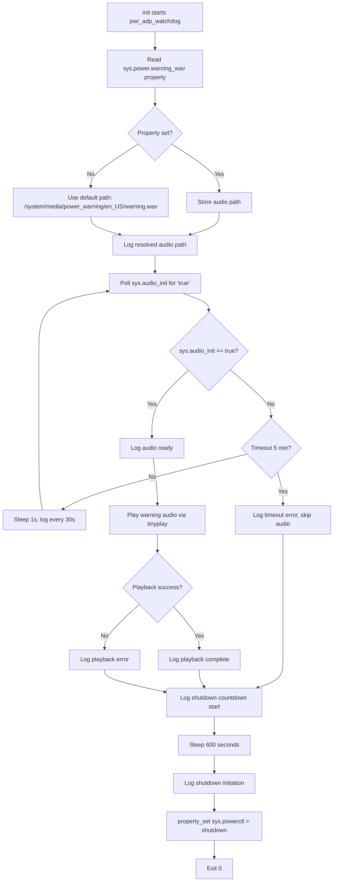
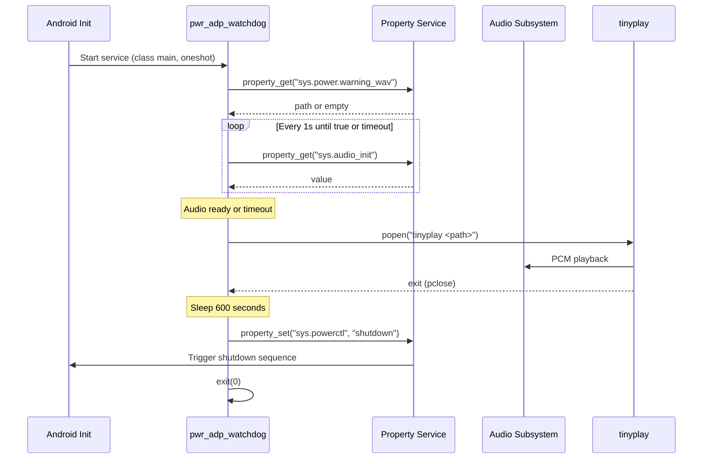

# Design Document: pwr_adp_watchdog

## Overview

The `pwr_adp_watchdog` service is a native C++ daemon for FireOS 8 that implements a power adapter safety watchdog. On boot, the service:

1. Reads the warning audio file path from a system property (or uses a hardcoded default)
2. Waits for the audio subsystem to initialize (polling a system property)
3. Plays the warning audio to alert the user
4. Waits 10 minutes, then triggers a device shutdown

The service is declared as a `oneshot` init service, meaning it runs its sequence exactly once and exits. It lives alongside other system daemons in `frameworks/base/cmds/` and follows the same patterns as `bootanimation` for build configuration and init integration.

### Design Decisions

| Decision | Choice | Rationale |
|----------|--------|-----------|
| Audio playback mechanism | `tinyplay` via `popen()` | Simplest approach; avoids linking OpenSLES or AudioTrack. `tinyplay` is already built in the tree and handles WAV playback natively. |
| Polling mechanism | `property_get` in a `sleep()` loop | Standard Android pattern for property-based synchronization. Lightweight, no binder or socket needed. |
| Shutdown mechanism | `property_set("sys.powerctl", "shutdown")` | Standard Android mechanism used by other services (see MTK FtModule references). Init handles the actual power-off. |
| Language | C++ (minimal, mostly C-style) | Consistent with other daemons in `frameworks/base/cmds/`. Allows use of `cutils/properties.h` and ALOG macros. |
| Build system | Android.bp | Standard for native binaries in AOSP/FireOS 8 tree. |

## Architecture



### System Interaction Diagram



## Components and Interfaces

### File Layout

```
frameworks/base/cmds/pwr_adp_watchdog/
├── Android.bp              # Build configuration
├── pwr_adp_watchdog.rc     # Init service declaration
└── pwr_adp_watchdog.cpp    # Main daemon source
```

### Component: pwr_adp_watchdog.cpp

The main source file containing all logic. Given the straightforward sequential nature of this daemon, a single-file implementation is appropriate.

#### Function Signatures

```cpp
#define LOG_TAG "pwr_adp_watchdog"

#include <cutils/properties.h>
#include <log/log.h>
#include <stdio.h>
#include <stdlib.h>
#include <string.h>
#include <unistd.h>
#include <time.h>

// Constants
static const char* PROP_WARNING_WAV = "sys.power.warning_wav";
static const char* PROP_AUDIO_INIT  = "sys.audio_init";
static const char* PROP_POWERCTL    = "sys.powerctl";
static const char* DEFAULT_WAV_PATH = "/system/media/power_warning/en_US/warning.wav";

static const int AUDIO_INIT_POLL_INTERVAL_SEC = 1;
static const int AUDIO_INIT_TIMEOUT_SEC       = 300;  // 5 minutes
static const int AUDIO_INIT_LOG_INTERVAL_SEC  = 30;
static const int SHUTDOWN_DELAY_SEC           = 600;  // 10 minutes

/**
 * get_warning_wav_path - Reads the warning WAV path from system property.
 *
 * Reads PROP_WARNING_WAV. If empty/unset, returns DEFAULT_WAV_PATH.
 * For initial implementation, always returns DEFAULT_WAV_PATH.
 *
 * @param out_path: buffer to store the resolved path (min PROPERTY_VALUE_MAX bytes)
 */
static void get_warning_wav_path(char* out_path);

/**
 * wait_for_audio_init - Polls sys.audio_init until "true" or timeout.
 *
 * Polls every AUDIO_INIT_POLL_INTERVAL_SEC seconds.
 * Logs a waiting message every AUDIO_INIT_LOG_INTERVAL_SEC seconds.
 * Returns true if audio initialized, false if timed out.
 *
 * @return true if audio subsystem is ready, false on timeout
 */
static bool wait_for_audio_init();

/**
 * play_warning_audio - Plays the WAV file using tinyplay.
 *
 * Invokes tinyplay via popen() and waits for completion via pclose().
 * Returns true on success, false on any failure (file missing, playback error).
 *
 * @param wav_path: absolute path to the WAV file
 * @return true if playback completed successfully, false otherwise
 */
static bool play_warning_audio(const char* wav_path);

/**
 * initiate_shutdown - Sets sys.powerctl to "shutdown".
 *
 * Logs the shutdown initiation message, then calls property_set.
 */
static void initiate_shutdown();

/**
 * main - Entry point. Orchestrates the full watchdog sequence.
 */
int main(int argc, char** argv);
```

### Component: pwr_adp_watchdog.rc

```rc
service pwr_adp_watchdog /system/bin/pwr_adp_watchdog
    class main
    user media
    group audio system
    oneshot
    disabled
```

**Notes:**
- `class main` — starts with the main class of services during boot.
- `user media` — same user as bootanimation; has access to audio resources.
- `group audio system` — `audio` for playback access, `system` for property access.
- `oneshot` — init does not restart the service after it exits.
- `disabled` — the service won't auto-start unless explicitly triggered by a property trigger or `start` command in another .rc. The actual trigger mechanism (e.g., `on property:sys.power.warning=1`) will be defined based on the product's boot flow.

### Component: Android.bp

```bp
cc_binary {
    name: "pwr_adp_watchdog",

    srcs: ["pwr_adp_watchdog.cpp"],

    shared_libs: [
        "libcutils",
        "liblog",
    ],

    init_rc: ["pwr_adp_watchdog.rc"],

    cflags: [
        "-Wall",
        "-Werror",
        "-Wunused",
        "-Wunreachable-code",
    ],
}
```

## Data Models

This service has minimal data. The primary state is tracked through local variables in `main()`:

```cpp
// State tracked during execution
struct WatchdogState {
    char wav_path[PROPERTY_VALUE_MAX];   // Resolved audio file path
    bool audio_init_ready;               // Whether audio init succeeded (vs timeout)
    bool audio_played;                   // Whether audio playback completed successfully
};
```

No persistent storage is required. The service runs once and exits.

### System Properties Used

| Property | Direction | Purpose |
|----------|-----------|---------|
| `sys.power.warning_wav` | Read | Path to warning WAV file |
| `sys.audio_init` | Read (poll) | Audio subsystem readiness signal |
| `sys.powerctl` | Write | Trigger device shutdown |

## Correctness Properties

*A property is a characteristic or behavior that should hold true across all valid executions of a system — essentially, a formal statement about what the system should do. Properties serve as the bridge between human-readable specifications and machine-verifiable correctness guarantees.*

### Property 1: Poll loop exits only on "true"

*For any* sequence of `sys.audio_init` property values returned during polling, the `wait_for_audio_init()` function SHALL proceed to return `true` only when the property value equals the string "true" (case-sensitive exact match), and SHALL continue polling for any other value.

**Validates: Requirements 3.1, 3.3**

### Property 2: Periodic logging during wait

*For any* wait duration of N seconds (where N <= 300), the number of "waiting for audio init" log messages emitted SHALL be equal to floor(N / 30), ensuring one log message every 30 seconds of waiting.

**Validates: Requirements 6.2**

## Error Handling

| Error Condition | Behavior | Requirement |
|----------------|----------|-------------|
| `sys.power.warning_wav` empty/unset | Use default path `/system/media/power_warning/en_US/warning.wav` | Req 2.2 |
| Audio init timeout (5 min) | Log error, skip audio, proceed to shutdown delay | Req 3.4 |
| WAV file not found / cannot open | Log error, proceed to shutdown delay | Req 4.3 |
| `tinyplay` execution fails | Log error, proceed to shutdown delay | Req 4.4 |
| `tinyplay` returns non-zero exit code | Log error, proceed to shutdown delay | Req 4.4 |

**Design principle:** The service always reaches the shutdown step regardless of intermediate failures. Audio playback is best-effort; shutdown is mandatory.

### Error Handling in play_warning_audio()

```cpp
static bool play_warning_audio(const char* wav_path) {
    // 1. Check file existence with access(wav_path, R_OK)
    //    - If fails: ALOGE, return false
    // 2. Build command: "tinyplay <wav_path>"
    // 3. popen() the command
    //    - If fails: ALOGE, return false
    // 4. pclose() and check exit status
    //    - If non-zero: ALOGE, return false
    // 5. return true
}
```

## Testing Strategy

### Unit Testing

Given the nature of this daemon (system-level, property-dependent, calls external tools), testing is primarily done via:

1. **Integration tests on device**: Verify the end-to-end flow by setting properties and observing behavior via logcat.
2. **Component tests with mocked properties**: Test the logic of `wait_for_audio_init()` and `get_warning_wav_path()` by mocking `property_get`.

**Key test scenarios:**
- Property not set → default path used
- Audio init becomes true after N seconds → proceeds to playback
- Audio init never becomes true → timeout after 300s, skip audio
- WAV file missing → error logged, proceeds to shutdown
- Happy path → audio plays, 10-min wait, shutdown triggered

### Property-Based Testing

Property-based testing has limited applicability here because:
- The service is primarily a sequencer of side effects (property reads, process spawning, property writes)
- The core logic (poll loop) can be tested with a property test by mocking `property_get` to return generated sequences

**Applicable property tests:**
- **Property 1**: Generate random sequences of strings (none equal to "true"), followed by "true". Verify `wait_for_audio_init()` only returns `true` after encountering the "true" value.
- **Property 2**: For random wait durations (1-300s), verify the log count matches floor(duration / 30).

**Testing library**: Google Test with a custom property-test harness, or if available, use a C++ PBT library like [RapidCheck](https://github.com/emil-e/rapidcheck).

**Configuration**: Minimum 100 iterations per property test.

**Tag format:**
- `Feature: pwr-adp-watchdog, Property 1: Poll loop exits only on "true"`
- `Feature: pwr-adp-watchdog, Property 2: Periodic logging during wait`

### Smoke Tests

- Verify `.rc` file declares service correctly (oneshot, class, user, group)
- Verify `Android.bp` builds the binary successfully
- Verify binary exists at `/system/bin/pwr_adp_watchdog` on device

### On-Device Integration Tests

1. Set `sys.power.warning_wav` to a valid WAV path, start service, verify audio plays via logcat
2. Do not set `sys.audio_init`, verify timeout after 5 minutes in logcat
3. Set `sys.audio_init=true`, verify full flow completes and `sys.powerctl` is set to "shutdown"
4. Use a non-existent WAV path, verify error log and shutdown still occurs
